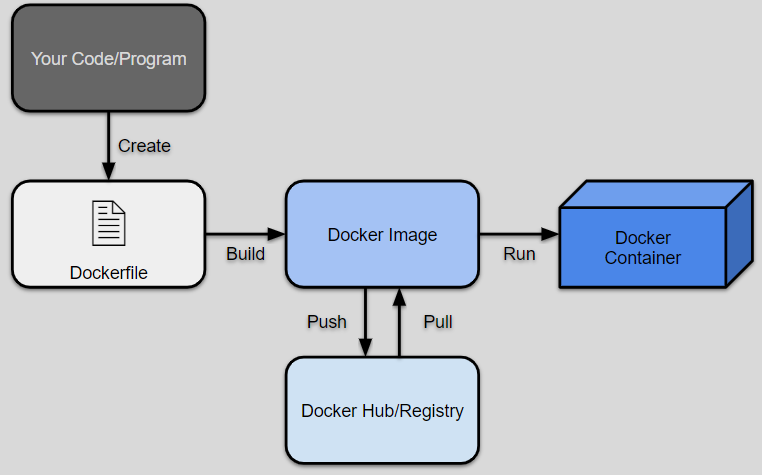

# Project Topic: AI News 📰

# Student Guide to Docker 📚
## Intro: What Is Docker? 

**Docker** is a tool that performs containerization, allowing a user to easily run and manage many containers. 

### Key Terms:

* **Container:** A lightweight environment that holds the program code and files. 
    * It runs on the host computer using its kernel which manages the hardware (cpu, memory, etc) and bridges it to the software
    * This makes it isolated meaning it can't touch anything outside of itself. 

* **Docker Image:** A template that has everything the program needs from code to the dependencies it uses. 
    * This image is created from a dockerfile that holds instructions on how to set it up and says what to install

## I. Learn more about why you would use Dockers containerization over just a virtual machine: 
### [Virtualization vs. Containerization](/VirtualizationVSContainerization.md)

## II. Don't other containerization softwares like Kubernetes exist? Why use Docker over them? 
### [Docker vs. Kubernetes](/DockerVSKubernetes.md)
<!--SVG From svgrepo-->

<!--SVG From svgrepo-->

## III. Convinced? You can learn how to install Docker and set it up here: 
### <!--SVG From Google Fonts--> <svg xmlns="http://www.w3.org/2000/svg" height="24px" viewBox="0 -960 960 650" width="24px" fill="#5985E1"><path d="M480-320 280-520l56-58 104 104v-326h80v326l104-104 56 58-200 200ZM240-160q-33 0-56.5-23.5T160-240v-120h80v120h480v-120h80v120q0 33-23.5 56.5T720-160H240Z"/></svg> [Installation Process](/InstallationSetup.md)

# Student Guide to CI/CD 📚